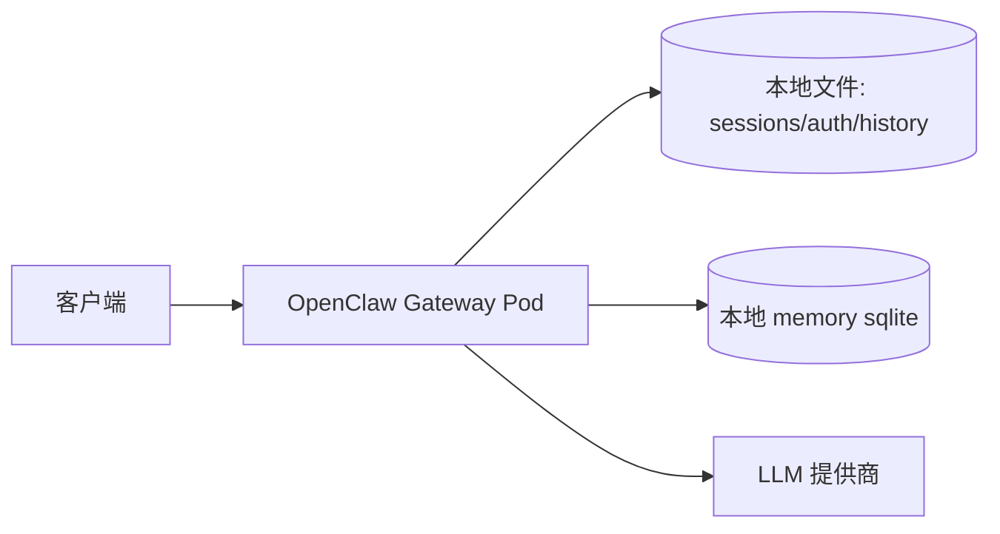
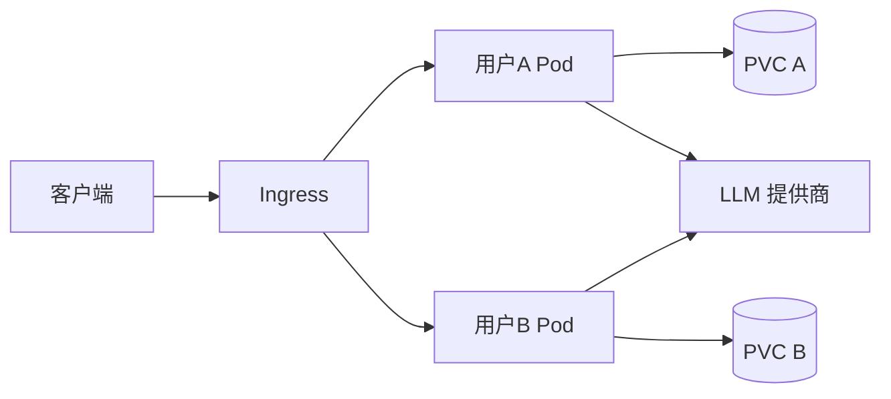
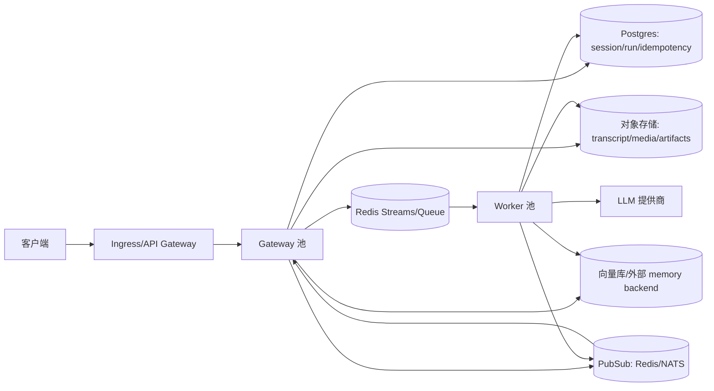
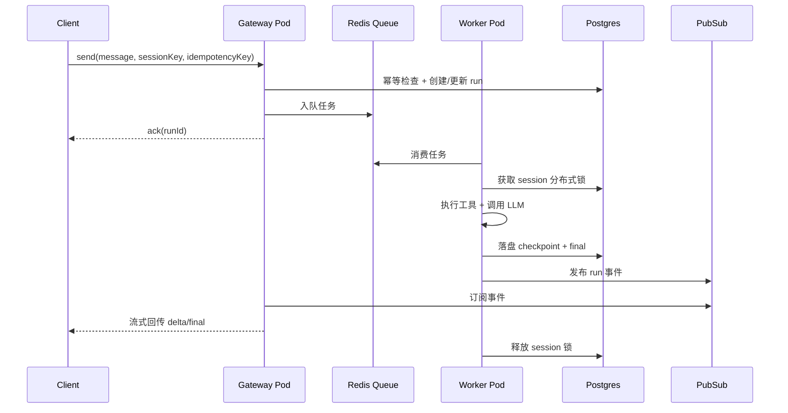

# OpenClaw 高可用高并发架构演进方案

## 1）目标

构建一个兼顾成本与可扩展性的 OpenClaw 部署模型：

- 按活跃并发扩容，而不是按用户总数扩容
- 用户个性化配置、会话历史、运行结果可持久化
- 保证会话级串行（同一 `sessionKey` 同时只允许一个运行）
- 支持多租户隔离与弹性伸缩

## 2）架构演进

### V0：单实例 + 本地状态（当前基线）

特点：

- 启动快、实现简单
- 适合低并发
- 单点明显，节点故障恢复能力有限

### V1：每用户一个 Pod + 持久卷

特点：

- 隔离强，思路直观
- 工程复杂度较低
- 成本高，空闲用户也持续占资源

### V2：共享无状态池 + 外部高可用状态（目标）

特点：

- 适合高并发、多租户、成本优化
- 可按活跃负载水平扩容
- 通过外部状态实现跨 Pod 连续性与容灾

## 3）图例说明

- `Gateway 池`：无状态入口层（HTTP/WebSocket）
- `Worker 池`：执行层（工具调用、模型推理、任务编排）
- `Postgres`：会话与运行状态权威存储
- `Redis Queue`：任务排队、削峰填谷、背压控制
- `PubSub`：事件广播，保证多副本实时推送一致
- `对象存储`：大对象与归档数据持久化

## 4）请求生命周期（目标形态）

关键不变量：

- 任意时刻每个 `sessionKey` 最多只有一个 Worker 在执行

## 5）针对 OpenClaw 的核心改造点

1. 会话存储外置
   - 现状：本地文件（`sessions.json` + `jsonl`）
   - 目标：引入 `SessionStoreAdapter`，保留 `fs` 实现，新增 `postgres` 实现

2. 并发调度外置
   - 现状：进程内队列和 lane
   - 目标：分布式队列 + 分布式锁（保持现有 lane 语义）

3. 幂等与去重外置
   - 现状：进程内 `Map`
   - 目标：`idempotencyKey -> runResult` 写入 Postgres/Redis

4. 鉴权资料外置
   - 现状：`auth-profiles.json` 本地文件
   - 目标：密钥托管（KMS/Secret Manager），运行时短期凭证下发

5. 事件总线化
   - 现状：进程内广播
   - 目标：PubSub 统一事件分发，客户端连接任意 Pod 都可接收事件

## 6）数据分层建议

- Postgres
  - `tenants`
  - `sessions`
  - `runs`
  - `messages`（结构化元数据）
  - `idempotency_records`
  - `session_locks/leases`
- 对象存储
  - transcript 原文
  - 工具产物
  - 大文本与附件
- Redis
  - 任务队列
  - 短时锁
  - 实时事件分发
- 向量检索层
  - embedding
  - 语义记忆索引

## 7）迁移路线

### 阶段 A：抽象层先行

- 增加 `Session/Auth/Idempotency/EventBus` 统一接口
- 默认继续走文件实现，保证可回滚

### 阶段 B：状态外置试点

- 会话元数据、幂等记录上 Postgres
- transcript 主体转对象存储
- Worker 先保持单副本

### 阶段 C：执行层分布式化

- 跑通 Redis 队列消费
- 引入 session 分布式锁
- 横向扩 Worker 副本

### 阶段 D：HA 加固

- Postgres/Redis 多可用区
- 健康检查、重试、熔断、限流
- SLO 监控与告警闭环

## 8）K8s 部署建议

- `Deployment`：Gateway 池
- `Deployment`：Worker 池
- `HPA`：按队列积压 + CPU 扩缩容
- `PodDisruptionBudget`：保护可用性
- 托管 Postgres + 托管 Redis + 对象存储

建议扩缩容指标：

- 队列延迟/积压（主指标）
- Worker CPU/内存（辅指标）
- Gateway 活跃连接数（辅指标）

## 9）故障处理语义

- Worker 崩溃
  - 锁租约超时后自动释放
  - 任务可重试，按 checkpoint 恢复

- Gateway 崩溃
  - 客户端重连到其他 Pod
  - 运行状态由外部存储恢复

- 重复提交
  - 同 `idempotencyKey` 直接返回已有 run/result

## 10）成本结论

- 每用户独立 Pod 是“隔离优先”，不是“成本最优”
- 共享无状态池是“成本最优”常见路线
- 可采用分层策略：
  - 普通租户：共享池
  - 高合规/VIP：独享 Worker 或独享命名空间

## 11）验收标准（最小可用）

- 可用性：API 99.9%
- 一致性：高并发下无跨会话串话
- 弹性：10x 突发并发可稳定扩容
- 恢复：杀 Pod 不丢已提交 run 状态
